<picture> 
<source srcset="./profile/wakatime-dark.svg" media="(prefers-color-scheme: dark)"/>
<source srcset="./profile/wakatime-light.svg" media="(prefers-color-scheme: light), (prefers-color-scheme: no-preference)"/>

</picture>

<!-- my-badges start -->

<!-- my-badges end -->
